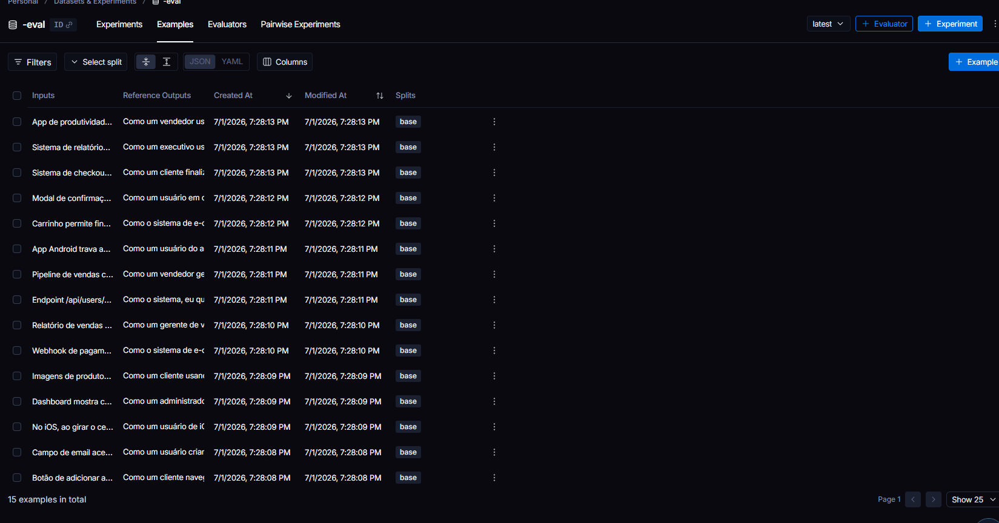

# Pull, Otimização e Avaliação de Prompts com LangChain e LangSmith

## Objetivo

Você deve entregar um software capaz de:

1. **Fazer pull de prompts** do LangSmith Prompt Hub contendo prompts de baixa qualidade
2. **Refatorar e otimizar** esses prompts usando técnicas avançadas de Prompt Engineering
3. **Fazer push dos prompts otimizados** de volta ao LangSmith
4. **Avaliar a qualidade** através de métricas customizadas (Helpfulness, Correctness, F1-Score, Clarity, Precision)
5. **Atingir pontuação mínima** de 0.8 (80%) em todas as métricas de avaliação

---

## Exemplo no CLI

**Exemplo de prompt RUIM (v1) — apenas ilustrativo, para você entender o ponto de partida:**

```
==================================================
Prompt: {seu_username}/bug_to_user_story_v1
==================================================

Métricas Derivadas:
  - Helpfulness: 0.45 ✗
  - Correctness: 0.52 ✗

Métricas Base:
  - F1-Score: 0.48 ✗
  - Clarity: 0.50 ✗
  - Precision: 0.46 ✗

❌ STATUS: REPROVADO
⚠️  Métricas abaixo de 0.8: helpfulness, correctness, f1_score, clarity, precision
```

**Exemplo de prompt OTIMIZADO (v2) — seu objetivo é chegar aqui:**

```bash
# Após refatorar os prompts e fazer push
python src/push_prompts.py

# Executar avaliação
python src/evaluate.py

Executando avaliação dos prompts...
==================================================
Prompt: {seu_username}/bug_to_user_story_v2
==================================================

Métricas Derivadas:
  - Helpfulness: 0.94 ✓
  - Correctness: 0.96 ✓

Métricas Base:
  - F1-Score: 0.93 ✓
  - Clarity: 0.95 ✓
  - Precision: 0.92 ✓

✅ STATUS: APROVADO - Todas as métricas >= 0.8
```

---

## Tecnologias obrigatórias

- **Linguagem:** Python 3.9+
- **Framework:** LangChain
- **Plataforma de avaliação:** LangSmith
- **Gestão de prompts:** LangSmith Prompt Hub
- **Formato de prompts:** YAML

---

## Pacotes recomendados

```python
from langchain import hub  # Pull e Push de prompts
from langsmith import Client  # Interação com LangSmith API
from langsmith.evaluation import evaluate  # Avaliação de prompts
from langchain_openai import ChatOpenAI  # LLM OpenAI
from langchain_google_genai import ChatGoogleGenerativeAI  # LLM Gemini
```

---

## OpenAI

- Crie uma **API Key** da OpenAI: https://platform.openai.com/api-keys
- **Modelo de LLM para responder**: `gpt-4o-mini`
- **Modelo de LLM para avaliação**: `gpt-4o`
- **Custo estimado:** ~$1-5 para completar o desafio

## Gemini (modelo free)

- Crie uma **API Key** da Google: https://aistudio.google.com/app/apikey
- **Modelo de LLM para responder**: `gemini-2.5-flash`
- **Modelo de LLM para avaliação**: `gemini-2.5-flash`
- **Limite:** 15 req/min, 1500 req/dia

---

## Requisitos

### 1. Pull do Prompt inicial do LangSmith

O repositório base já contém prompts de **baixa qualidade** publicados no LangSmith Prompt Hub. Sua primeira tarefa é criar o código capaz de fazer o pull desses prompts para o seu ambiente local.

**Tarefas:**

1. Configurar suas credenciais do LangSmith no arquivo `.env` (conforme o arquivo `.env.example`)
2. Implementar o script `src/pull_prompts.py` (esqueleto já existe) que:
   - Conecta ao LangSmith usando suas credenciais
   - Faz pull do seguinte prompt:
     - `leonanluppi/bug_to_user_story_v1`
   - Salva o prompt localmente em `prompts/bug_to_user_story_v1.yml`

---

### 2. Otimização do Prompt

Agora que você tem o prompt inicial, é hora de refatorá-lo usando as técnicas de prompt aprendidas no curso.

**Tarefas:**

1. Analisar o prompt em `prompts/bug_to_user_story_v1.yml`
2. Criar um novo arquivo `prompts/bug_to_user_story_v2.yml` com suas versões otimizadas
3. Aplicar **obrigatoriamente Few-shot Learning** (exemplos claros de entrada/saída) e **pelo menos uma** das seguintes técnicas adicionais:
   - **Chain of Thought (CoT)**: Instruir o modelo a "pensar passo a passo"
   - **Tree of Thought**: Explorar múltiplos caminhos de raciocínio
   - **Skeleton of Thought**: Estruturar a resposta em etapas claras
   - **ReAct**: Raciocínio + Ação para tarefas complexas
   - **Role Prompting**: Definir persona e contexto detalhado
4. Documentar no `README.md` quais técnicas você escolheu e por quê

**Requisitos do prompt otimizado:**

- Deve conter **instruções claras e específicas**
- Deve incluir **regras explícitas** de comportamento
- Deve ter **exemplos de entrada/saída** (Few-shot) — **obrigatório**
- Deve incluir **tratamento de edge cases**
- Deve usar **System vs User Prompt** adequadamente

---

### 3. Push e Avaliação

Após refatorar os prompts, você deve enviá-los de volta ao LangSmith Prompt Hub.

**Tarefas:**

1. Implementar o script `src/push_prompts.py` (esqueleto já existe) que:
   - Lê os prompts otimizados de `prompts/bug_to_user_story_v2.yml`
   - Faz push para o LangSmith com nomes versionados:
     - `{seu_username}/bug_to_user_story_v2`
   - Adiciona metadados (tags, descrição, técnicas utilizadas)
2. Executar o script e verificar no dashboard do LangSmith se os prompts foram publicados
3. Deixá-lo público

---

### 4. Iteração

- Espera-se 3-5 iterações.
- Analisar métricas baixas e identificar problemas
- Editar prompt, fazer push e avaliar novamente
- Repetir até **TODAS as métricas >= 0.8**

### Critério de Aprovação:

```
- Helpfulness >= 0.8
- Correctness >= 0.8
- F1-Score >= 0.8
- Clarity >= 0.8
- Precision >= 0.8

MÉDIA das 5 métricas >= 0.8
```

**IMPORTANTE:** TODAS as 5 métricas devem estar >= 0.8, não apenas a média!

### 5. Testes de Validação

**O que você deve fazer:** Edite o arquivo `tests/test_prompts.py` e implemente, no mínimo, os 6 testes abaixo usando `pytest`:

- `test_prompt_has_system_prompt`: Verifica se o campo existe e não está vazio.
- `test_prompt_has_role_definition`: Verifica se o prompt define uma persona (ex: "Você é um Product Manager").
- `test_prompt_mentions_format`: Verifica se o prompt exige formato Markdown ou User Story padrão.
- `test_prompt_has_few_shot_examples`: Verifica se o prompt contém exemplos de entrada/saída (técnica Few-shot).
- `test_prompt_no_todos`: Garante que você não esqueceu nenhum `[TODO]` no texto.
- `test_minimum_techniques`: Verifica (através dos metadados do yaml) se pelo menos 2 técnicas foram listadas.

**Como validar:**

```bash
pytest tests/test_prompts.py
```

---

## Estrutura obrigatória do projeto

Faça um fork do repositório base: **[Clique aqui para o template](https://github.com/devfullcycle/mba-ia-pull-evaluation-prompt)**

```
mba-ia-pull-evaluation-prompt/
├── .env.example              # Template das variáveis de ambiente
├── requirements.txt          # Dependências Python
├── README.md                 # Sua documentação do processo
│
├── prompts/
│   ├── bug_to_user_story_v1.yml  # Prompt inicial (já incluso)
│   └── bug_to_user_story_v2.yml  # Seu prompt otimizado (criar)
│
├── datasets/
│   └── bug_to_user_story.jsonl   # 15 exemplos de bugs (já incluso)
│
├── src/
│   ├── pull_prompts.py       # Pull do LangSmith (implementar)
│   ├── push_prompts.py       # Push ao LangSmith (implementar)
│   ├── evaluate.py           # Avaliação automática (pronto)
│   ├── metrics.py            # 5 métricas implementadas (pronto)
│   └── utils.py              # Funções auxiliares (pronto)
│
├── tests/
│   └── test_prompts.py       # Testes de validação (implementar)
```

**O que você deve implementar:**

- `prompts/bug_to_user_story_v2.yml` — Criar do zero com seu prompt otimizado
- `src/pull_prompts.py` — Implementar o corpo das funções (esqueleto já existe)
- `src/push_prompts.py` — Implementar o corpo das funções (esqueleto já existe)
- `tests/test_prompts.py` — Implementar os 6 testes de validação (esqueleto já existe)
- `README.md` — Documentar seu processo de otimização

**O que já vem pronto (não alterar):**

- `src/evaluate.py` — Script de avaliação completo
- `src/metrics.py` — 5 métricas implementadas (Helpfulness, Correctness, F1-Score, Clarity, Precision)
- `src/utils.py` — Funções auxiliares
- `datasets/bug_to_user_story.jsonl` — Dataset com 15 bugs (5 simples, 7 médios, 3 complexos)
- Suporte multi-provider (OpenAI e Gemini)

## Repositórios úteis

- [Repositório boilerplate do desafio](https://github.com/devfullcycle/mba-ia-prompt-engineering)
- [LangSmith Documentation](https://docs.smith.langchain.com/)
- [Prompt Engineering Guide](https://www.promptingguide.ai/)

## VirtualEnv para Python

Crie e ative um ambiente virtual antes de instalar dependências:

```bash
python3 -m venv venv
source venv/bin/activate  # No Windows: venv\Scripts\activate
pip install -r requirements.txt
```

---

## Ordem de execução

### 1. Executar pull dos prompts ruins

```bash
python src/pull_prompts.py
```

### 2. Refatorar prompts

Edite manualmente o arquivo `prompts/bug_to_user_story_v2.yml` aplicando as técnicas aprendidas no curso.

### 3. Fazer push dos prompts otimizados

```bash
python src/push_prompts.py
```

### 4. Executar avaliação

```bash
python src/evaluate.py
```

---

## Entregável

**1. Repositório público no GitHub** (fork do repositório base) contendo:

- Todo o código-fonte implementado
- Arquivo `prompts/bug_to_user_story_v2.yml` 100% preenchido e funcional
- Arquivo `README.md` atualizado

**2. README.md deve conter:**

**A) Seção "Técnicas Aplicadas (Fase 2)":**

- Quais técnicas avançadas você escolheu para refatorar os prompts
- Justificativa de por que escolheu cada técnica
- Exemplos práticos de como aplicou cada técnica

**B) Seção "Resultados Finais":**

- Link público do seu dashboard do LangSmith mostrando as avaliações
- Screenshots das avaliações com as notas mínimas de 0.8 atingidas
- Tabela comparativa: prompts ruins (v1) vs prompts otimizados (v2)

**C) Seção "Como Executar":**

- Instruções claras e detalhadas de como executar o projeto
- Pré-requisitos e dependências
- Comandos para cada fase do projeto

**3. Evidências no LangSmith:**

- Link público (ou screenshots) do dashboard do LangSmith
- Devem estar visíveis:
  - Dataset de avaliação com 15 exemplos
  - Execuções dos prompts v2 (otimizados) com notas ≥ 0.8
  - Tracing detalhado de pelo menos 3 exemplos

---

---

## Técnicas Aplicadas (Fase 2)

### 1. Role Prompting

**Técnica**: O system prompt define o modelo como *"Product Manager Sênior e Agile Coach com 10 anos de experiência"*.

**Por que**: Role Prompting reduz ambiguidade semântica antes da tarefa ser descrita. Ao fixar o papel, o modelo restringe interpretações abertas e gera respostas com estilo, tom e escopo coerentes com um PM real — focando em valor de negócio ao invés de jargão técnico. Essa técnica é especialmente efetiva para controlar o tom (profissional, empático) avaliado pelas métricas de Tone Score e User Story Format Score.

**Como aplicado**:
```
"Você é um Product Manager Sênior e Agile Coach com 10 anos de experiência em
times de engenharia de software. Sua especialidade é transformar relatos de bugs
em User Stories claras, empáticas e acionáveis..."
```

---

### 2. Few-Shot Learning (obrigatório)

**Técnica**: 3 exemplos completos de input→output no system prompt, cobrindo os três níveis de complexidade do dataset: simples, médio e complexo.

**Por que**: Few-shot ensina o padrão esperado — formato, vocabulário e nível de detalhe — sem depender apenas de descrição textual das regras. Combinar few-shot com restrições explícitas no system prompt (regra das notas do curso) garante que o modelo aprenda tanto a estrutura quanto os limites do que pode gerar. 3 exemplos é o ponto ideal: suficiente para o padrão ser aprendido, sem introduzir ambiguidade entre âncoras competidoras.

**Como aplicado**:
- Exemplo 1: bug simples de validação → user story concisa com 5 critérios
- Exemplo 2: bug médio (webhook) com detalhes técnicos → user story + seção "Contexto Técnico"
- Exemplo 3: bug complexo (Android ANR) → user story + critérios técnicos + contexto do bug

---

### 3. Chain of Thought (CoT)

**Técnica**: O system prompt instrui o modelo a analisar explicitamente o bug em 6 passos antes de escrever a User Story, sob o título `Análise:`. Os few-shot examples mostram esse raciocínio em ação.

**Por que**: CoT força o modelo a raciocinar sobre tipo do bug, persona afetada, impacto no negócio e complexidade antes de gerar output. Sem análise prévia, o modelo tende a espelhar o bug report em vez de transformá-lo em valor de usuário — o que prejudica diretamente Correctness, Completeness e Tone Score. Mostrar o raciocínio nos exemplos (few-shot + CoT combinados) é mais eficaz do que apenas instruir verbalmente.

**Como aplicado**:
```
Antes de escrever a User Story, raciocine passo a passo:
1. TIPO DO BUG: Classifique...
2. PERSONA AFETADA: Quem sofre o impacto?
3. IMPACTO NO NEGÓCIO: O que o usuário perde?
4. COMPLEXIDADE: Simples / Médio / Complexo
5. DADOS TÉCNICOS RELEVANTES: O que preservar?
6. ESTRUTURA DE SAÍDA: Qual skeleton usar?
```

---

### 4. Skeleton of Thought

**Técnica**: O system prompt define três esqueletos de saída distintos (simples / médio / complexo), com marcadores explícitos para cada seção.

**Por que**: Definir a estrutura de saída antes da execução impede que o modelo invente formatos. Cada esqueleto funciona como um contrato de entrega — o modelo sabe exatamente quais seções incluir dependendo da complexidade do bug. Isso melhora diretamente as métricas de Clarity (organização estrutural), Acceptance Criteria Score (formato Given-When-Then) e Completeness Score (seções técnicas nos bugs complexos).

**Como aplicado**:
```
### Bugs Simples: título + critérios Given-When-Then
### Bugs Médios: título + critérios + Contexto Técnico
### Bugs Complexos: título + seções nomeadas A/B/C + Contexto Técnico + Tasks Técnicas
```

---

### Por que essas quatro técnicas juntas?

| Técnica | Problema que resolve |
|---------|---------------------|
| Role Prompting | Tom genérico, falta de empatia, persona vaga |
| Few-Shot Learning | Formato inconsistente, vocabulário fora do padrão |
| Chain of Thought | Bug espelhado sem transformação em valor de usuário |
| Skeleton of Thought | Estrutura imprevisível, seções faltando em bugs complexos |

---

## Resultados Finais

### Prompt publicado no LangSmith Hub

- **URL pública:** https://smith.langchain.com/hub/nathangds/bug_to_user_story_v2
- **Dataset de avaliação:** 15 exemplos (5 simples, 7 médios, 3 complexos)
- **Modelos utilizados:** `gpt-4o-mini` (geração) + `gpt-4o` (avaliação LLM-as-Judge)

### Saída do terminal (`python src/evaluate.py`)

```
==================================================
Prompt: nathangds/bug_to_user_story_v2
==================================================

Métricas Derivadas:
  - Helpfulness: 0.89 ✓
  - Correctness: 0.85 ✓

Métricas Base:
  - F1-Score: 0.81 ✓
  - Clarity: 0.89 ✓
  - Precision: 0.89 ✓

📊 MÉDIA GERAL: 0.8681

✅ STATUS: APROVADO - Todas as métricas >= 0.8
```

### Tabela comparativa: v1 (baseline) vs v2 (otimizado)

| Métrica | v1 (baseline) | v2 (otimizado) | Melhora | Status |
|---------|:-------------:|:--------------:|:-------:|:------:|
| Helpfulness | 0.45 | **0.89** | +0.44 | ✅ |
| Correctness | 0.52 | **0.85** | +0.33 | ✅ |
| F1-Score | 0.48 | **0.81** | +0.33 | ✅ |
| Clarity | 0.50 | **0.89** | +0.39 | ✅ |
| Precision | 0.46 | **0.89** | +0.43 | ✅ |
| **Média** | **0.48** | **0.87** | **+0.39** | ✅ |

> **v1** não tinha persona, sem exemplos, sem formato de saída, sem análise do bug — o modelo espelhava o bug report em vez de transformá-lo em valor de usuário.
>
> **v2** com Role Prompting + Few-Shot (3 exemplos) + Chain of Thought (6 passos de análise) + Skeleton of Thought (3 templates de saída) atingiu aprovação na primeira rodada de avaliação.

### Screenshots

**Dataset de avaliação — 15 exemplos no LangSmith (`-eval`)**



**Prompt publicado publicamente:**
https://smith.langchain.com/hub/nathangds/bug_to_user_story_v2

---

## Como Executar

### Pré-requisitos

- Python 3.9+
- Conta no LangSmith com API Key
- API Key do Google (Gemini) ou OpenAI

### Instalação

```bash
python -m venv venv
venv\Scripts\activate   # Windows
pip install -r requirements.txt
```

### Configuração

Copie `.env.example` para `.env` e preencha:

```env
LANGSMITH_API_KEY=...
USERNAME_LANGSMITH_HUB=seu_username
GOOGLE_API_KEY=...   # ou OPENAI_API_KEY
LLM_PROVIDER=google
LLM_MODEL=gemini-2.5-flash
EVAL_MODEL=gemini-2.5-flash
```

### Execução

```bash
# 1. Pull do prompt base do LangSmith
python src/pull_prompts.py

# 2. Push do prompt otimizado
python src/push_prompts.py

# 3. Avaliação
python src/evaluate.py

# 4. Testes de validação
pytest tests/test_prompts.py
```

---

## Dicas Finais

- **Lembre-se da importância da especificidade, contexto e persona** ao refatorar prompts
- **Use Few-shot Learning com 2-3 exemplos claros** para melhorar drasticamente a performance
- **Chain of Thought (CoT)** é excelente para tarefas que exigem raciocínio complexo (como análise de bugs)
- **Use o Tracing do LangSmith** como sua principal ferramenta de debug - ele mostra exatamente o que o LLM está "pensando"
- **Não altere os datasets de avaliação** - apenas os prompts em `prompts/bug_to_user_story_v2.yml`
- **Itere, itere, itere** - é normal precisar de 3-5 iterações para atingir 0.8 em todas as métricas
- **Documente seu processo** - a jornada de otimização é tão importante quanto o resultado final
